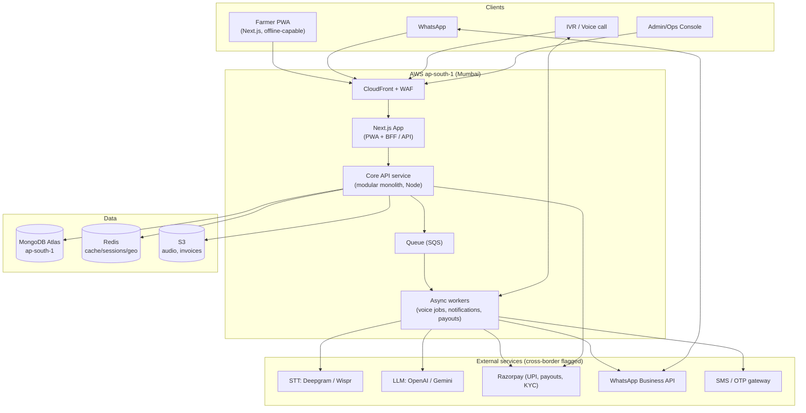
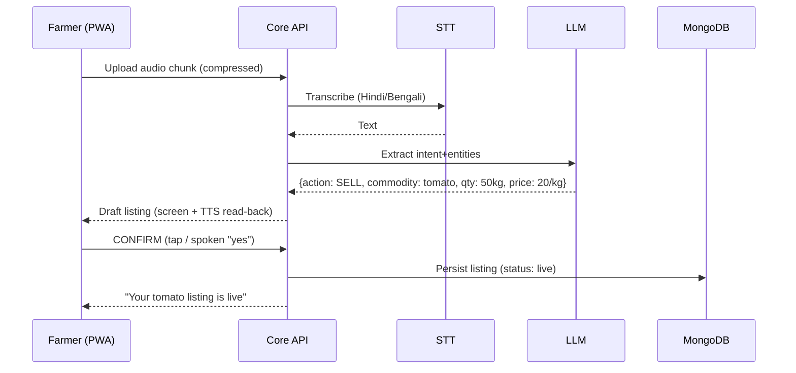

# ARCHITECTURE — Speak Yield

> **Status:** Draft, idea stage. Reflects confirmed decisions: single shared marketplace, phone+OTP (KYC-gated business accounts), voice-assisted with explicit confirm, AWS Mumbai residency.

---

## 1. System overview (Mermaid)

## 2. Request flow — the three core actions

### A. "Sell my 50 kg tomatoes for ₹20/kg" (voice → listing)

### B. "Order 5 L organic pesticide" (voice → input order → pay)
Same STT→LLM→**read-back→confirm** front half; then: match nearby dealer listing → create order (status: pending) → Razorpay UPI checkout → on webhook `payment.captured` → order `confirmed` → offer delivery job → GST invoice generated to S3.

### C. Delivery assignment
Order confirmed → matching service finds nearest available delivery partner within radius → SQS job → partner notified (push/WhatsApp) → accept → status transitions (picked_up → delivered) → payout to partner via Razorpay Route/payouts.

## 3. Monolith vs microservices — decision

**Decision: modular monolith** (a single deployable Core API service with clear internal modules: `auth`, `voice`, `catalog`, `orders`, `matching`, `logistics`, `payments`, `notifications`, `admin`), plus a **separate async worker** process for long-running/eventful work (voice transcription, notifications, payouts, invoice generation).

**Why:**
- Idea stage, **solo founder**, pilot scale — microservices' operational tax (service mesh, distributed tracing, N deployments) buys nothing yet and slows iteration.
- A well-modularised monolith keeps domain boundaries explicit, so modules can be extracted into services later *if and where* load demands (the voice pipeline and payments are the likely first extractions).
- The one justified split now is **sync API vs async workers**, because voice/STT/LLM/payout latency must not block request threads. They communicate via a queue (SQS).

**Trigger to revisit:** when a single module's scaling profile diverges sharply (e.g., voice traffic dwarfs everything) or the team grows past ~3–4 engineers. See [SCALABILITY.md](../04-infra/SCALABILITY.md).

## 4. Multi-tenancy model — decision

**Decision: single shared marketplace, one logical tenant, shared MongoDB cluster, role-based access.** Not schema-per-tenant, not DB-per-tenant.

**Why:** Speak Yield's core value is **cross-participant matching** (farmer ↔ buyer ↔ dealer ↔ delivery within a geography). Isolating participants into separate tenants/DBs would make the marketplace's central function — hyperlocal discovery and matching — expensive and unnatural. It also adds ops overhead a solo founder shouldn't carry at pilot stage.

**How organisations fit:** FPOs and dealer businesses are modelled as an optional **`organization`** entity; a user carries an `orgId` when they belong to one. This gives group reporting/rollups (e.g., an FPO seeing its farmers' listings) **without** data isolation. Access control is by **role + ownership + geography**, enforced in the API layer on every query — never by physical DB separation.

**Consequence:** every collection that holds user-owned data carries `ownerId` (and `orgId` where relevant); all queries are scoped by the authenticated principal. This discipline is the security boundary — see [SECURITY.md](../05-security-legal/SECURITY.md).

## 5. Cross-border data flow (residency)

All primary data lives in **AWS ap-south-1 (Mumbai)** and **MongoDB Atlas ap-south-1**. However, **STT (Deepgram/Wispr) and LLM (OpenAI/Gemini)** process voice/text abroad. Per the confirmed decision, this cross-border flow is **permitted for v1 with explicit user consent and disclosure** rather than self-hosting models. Audio is transient where possible; retention and consent are specified in [DATA_RETENTION.md](../05-security-legal/DATA_RETENTION.md) and [COMPLIANCE.md](../05-security-legal/COMPLIANCE.md).
