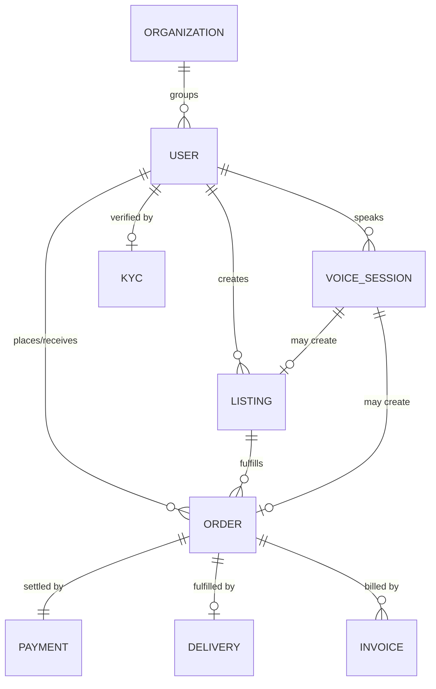

# DATABASE_SCHEMA — Speak Yield

> **Status:** Draft, idea stage. MongoDB (document model). Single shared marketplace — isolation is by `ownerId`/`role`/geo in the app layer, **not** by separate DBs. All collections in MongoDB Atlas **ap-south-1**.

---

## Entity overview (Mermaid ER)

## Collections

### `organizations`
FPOs and dealer businesses. `{ _id, type: FPO|DEALER, name, address, geo, verified, createdAt }`

### `users`
`{ _id, phone (unique), role: farmer|buyer|dealer|delivery|admin, name, preferredLanguage: hi|bn|od, orgId?, location{ geo:[lng,lat], district, state }, kycStatus: none|pending|verified, accountTier: basic|verified_business, createdAt, lastActiveAt }`
- Phone is the identity (auth). `accountTier` gates at-volume transacting/payouts.

### `kyc`
`{ _id, userId, provider: razorpay, docType, status, verifiedAt, providerRef }` — no raw document images stored; references to provider. See [SECURITY.md](../05-security-legal/SECURITY.md).

### `listings`
Both input listings (dealer) and produce listings (farmer).
`{ _id, ownerId, orgId?, kind: input|produce, commodity, variant, quantity{value,unit}, price{value,unit,currency:INR}, status: draft|live|matched|closed, location{geo}, coverageRadiusKm, createdViaVoiceSessionId?, createdAt, expiresAt }`

### `orders`
`{ _id, buyerId, sellerId, listingId, kind: buy_input|sell_produce, items[{commodity, qty, unitPrice}], amounts{ subtotal, platformFee, deliveryFee, tax, total }, status: pending|confirmed|assigned|picked_up|delivered|cancelled|refunded, paymentId?, deliveryId?, createdViaVoiceSessionId?, confirmedByUserAt, createdAt }`
- `confirmedByUserAt` records the **explicit confirm** (tap/voice) — required before `confirmed`.

### `payments`
`{ _id, orderId, provider: razorpay, method: upi, providerOrderId, providerPaymentId, amount, currency:INR, status: created|captured|failed|refunded, breakdown, createdAt, capturedAt }`
- No card/UPI credentials stored — only Razorpay references (PCI scope minimised).

### `deliveries`
`{ _id, orderId, partnerId?, status: unassigned|offered|accepted|picked_up|delivered|failed, pickup{geo}, drop{geo}, fee, payoutId?, timeline[{status,at}], createdAt }`

### `voice_sessions`
`{ _id, userId, language, audioRef (S3), transcript, intent, entities{}, provider{stt, llm}, outcome: draft_order|draft_listing|query|failed, linkedOrderId?, linkedListingId?, consentCrossBorder: bool, createdAt }`
- Central to analytics (intent accuracy) and to the cross-border consent record.

### `invoices`
`{ _id, orderId, number, gstin?, hsnSac, taxBreakup, pdfRef (S3), issuedAt }` — GST-compliant. See [COMPLIANCE.md](../05-security-legal/COMPLIANCE.md).

### `notifications`
`{ _id, userId, channel: push|sms|whatsapp|voice, template, payload, status, sentAt }`

### `audit_logs`
`{ _id, actorId, action, entity, entityId, meta, ip, at }` — security/compliance trail; no PII in plaintext beyond what's necessary. See [MONITORING_LOGGING.md](../04-infra/MONITORING_LOGGING.md).

---

## Indexing strategy

Derived from the core queries (hyperlocal matching, order lookups, auth):

| Collection | Index | Serves |
|---|---|---|
| `users` | unique `{phone}` | login/lookup |
| `users` | `2dsphere {location.geo}` | nearby partners/participants |
| `listings` | `2dsphere {location.geo}` + `{commodity, status}` | hyperlocal discovery/matching (FR-M1) |
| `listings` | `{ownerId, status}` | "my listings" |
| `listings` | TTL on `{expiresAt}` | auto-expire stale produce listings |
| `orders` | `{buyerId, createdAt}`, `{sellerId, createdAt}` | order history |
| `orders` | `{status, createdAt}` | ops/matching queues |
| `payments` | unique `{providerPaymentId}`, `{orderId}` | idempotent webhook handling |
| `deliveries` | `{status}`, `2dsphere {pickup.geo}` | job dispatch to nearest partner |
| `voice_sessions` | `{userId, createdAt}`, `{outcome}` | analytics, intent accuracy |
| `audit_logs` | `{entity, entityId, at}` | investigations; TTL per retention policy |

**Notes**
- Geospatial (`2dsphere`) indexes are the backbone of hyperlocal matching — the deck's central feature.
- Money fields stored as integer paise (avoid float rounding) ⚠️ confirm convention.
- Webhook idempotency enforced via unique provider-reference indexes.
- Retention/TTL specifics (audio, logs, backups) in [DATA_RETENTION.md](../05-security-legal/DATA_RETENTION.md).
