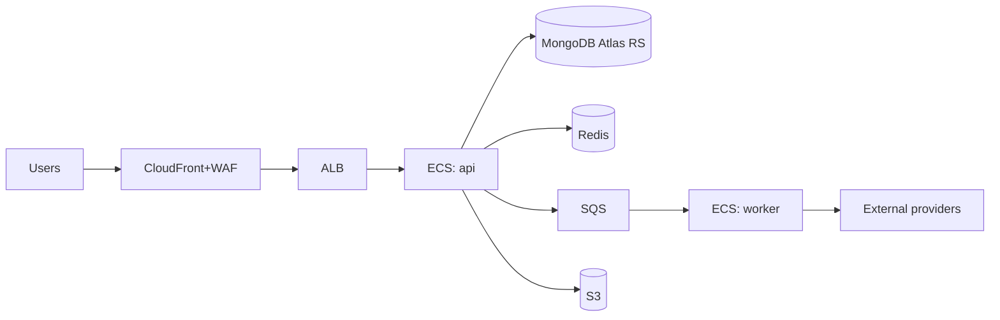

# INFRASTRUCTURE — Speak Yield

> **Status:** Draft, idea stage. Hosting sized for a district pilot with a clear path to regional scale. Region choice is driven by the target geography (Eastern India) and Indian data-residency law.

---

## Region & residency
- **Primary region: AWS `ap-south-1` (Mumbai).** All compute, database, object storage, backups, and logs live in India.
- **Why:** target users are Indian farmers (pilot in West Bengal); DPDP Act 2023 + RBI payment-data localization require India residency; lowest latency for Eastern India.
- **Cross-border exception:** STT/LLM providers (Deepgram/Wispr, OpenAI/Gemini) process voice/text abroad — permitted for v1 **with explicit user consent + disclosure** (see [COMPLIANCE.md](../05-security-legal/COMPLIANCE.md)). A second Indian region (`ap-south-2`, Hyderabad) is a future DR option.

## Topology (v1)
- **CloudFront + WAF** → edge/CDN + basic protection.
- **ECS Fargate** running two service groups: `api` (sync Core API) and `worker` (async voice/notifications/payouts). Auto-scaling on CPU + queue depth.
- **MongoDB Atlas** (ap-south-1), replica set (3 nodes) with automated backups.
- **ElastiCache Redis** — sessions, OTP throttle, hot listings, geo sets.
- **S3** (ap-south-1) — audio + invoices, with lifecycle rules.
- **SQS** — async job queue.
- **Secrets Manager / SSM** — all secrets.
- **VPC** — private subnets for compute/data; NAT for egress to providers; least-privilege security groups.
- **Terraform** — all infra as code, reproducible per environment.

## Backups
- **MongoDB Atlas:** continuous backup with point-in-time recovery; automated daily snapshots retained 30 days (⚠️ confirm). Snapshots stay in-region (India).
- **S3:** versioning on invoice bucket; cross-region copy **only within India** if/when DR region added.
- **Backup restores tested quarterly** (restore drill), not assumed.
- Retention specifics in [DATA_RETENTION.md](../05-security-legal/DATA_RETENTION.md).

## Disaster recovery
| Metric | v1 (pilot) target | Notes |
|---|---|---|
| **RPO** | ≤ 1 hour | PITR + frequent snapshots make this achievable; tighten later. |
| **RTO** | ≤ 4 hours | Redeploy from Terraform + restore latest snapshot into ap-south-1. |
- **DR strategy v1:** single-region, multi-AZ (Fargate across AZs, Atlas replica set across AZs) — survives an AZ failure automatically. Full-region loss handled by IaC redeploy + Atlas restore.
- **DR strategy v2+:** warm standby in a second Indian region as scale/SLAs demand.
- DR runbook lives with [INCIDENT_RESPONSE.md](./INCIDENT_RESPONSE.md).

## Cost posture
- Idea stage / no external funding → favour managed + serverless (Fargate, Atlas, SQS) to minimise ops headcount; scale-to-need over pre-provisioning. Revisit reserved capacity once pilot volume is real.
